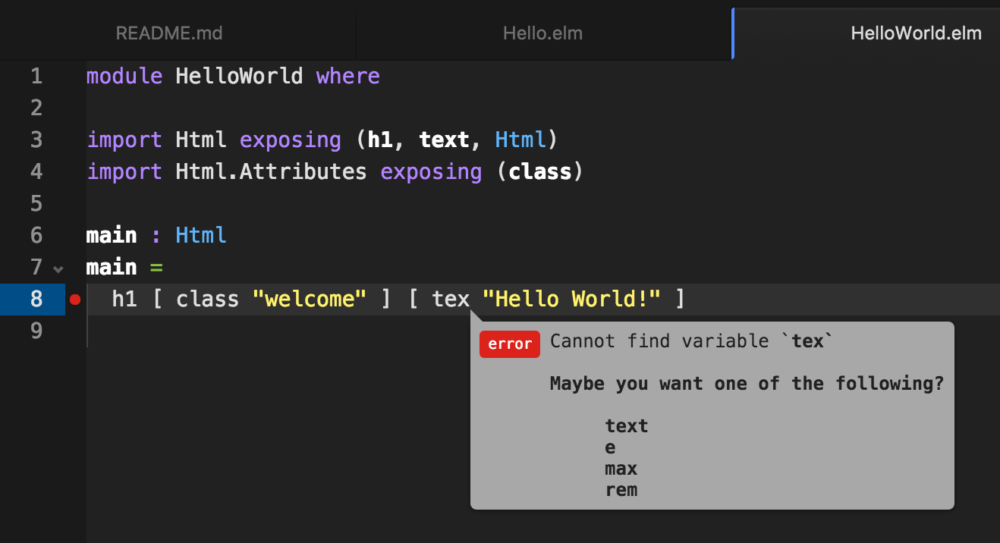

# Elm Workshop

## Functional Kats February 2016

### Michael Twomey
### @micktwomey

---

# What is Elm?

> The best of functional programming in your browser
-- elm-lang.org

- Focussed on the web front end
- Strongly Typed (in a good way)
- ML inspired
- Compiles to Javascript
- Compiler is your friend (really!)

---

# What I'll be covering

1. Getting start with Elm
1. Elm basics
1. Hopefully some Elm less basics :smile:

Feel free to interrupt to ask questions and correct me.

---

# A Taste of Elm

```haskell
module HelloWorld where

import Html exposing (h1, text, Html)
import Html.Attributes exposing (class)

main : Html
main =
  h1 [ class "welcome" ] [ text "Hello World!" ]
```

^ Don't fret, I'll cover this
^ See slide_examples/HelloWorld.elm
^ Showing module declaration
^ Showing imports
^ Showing exposing
^ Showing type declaration
^ Showing function calls and lists

---

# A Taste of Elm (Graphical!)

```haskell
module HelloText where

import Graphics.Element exposing (Element, leftAligned)
import Text exposing (..)

text : Text
text =
  Text.fromString "Hello World!"
    |> bold
    |> height 24

main : Element
main = leftAligned text
```

^ See slide_examples/HelloText.elm
^ Showing the graphics code (canvas)
^ Showing pipe operator
^ Showing namespaces
^ Showing exposing (..)

---

# Let's Get Started!

---

# [fit] Some Boring Setup Bits

# [fit] Install Elm

# [fit] http://elm-lang.org/install

# [fit] NB version 0.16

^ If Elm 0.17 is released before we start this stick with 0.16 :)

---

# [fit] Editor Setup!

---

# [fit] Install Atom (Controversial!)

# [fit] https://atom.io



^ If you don't have a preferred editor then Atom is a good choice for elm

---

# [fit] Install Plugins

## [fit] language-elm
## [fit] linter-elm-make

---

# Setup Code

```sh
git clone https://github.com/micktwomey/elm-functionalkats-tutorial.git
cd elm-functionalkats-tutorial
elm package install
```

---

# [fit] Digression: Package Manager
## (It's very polite)

```
Some new packages are needed. Here is the upgrade plan.

  Install:
    elm-lang/core 3.0.0
    evancz/elm-html 4.0.2
    evancz/virtual-dom 2.1.0

Do you approve of this plan? (y/n) y
Downloading elm-lang/core
Downloading evancz/elm-html
Downloading evancz/virtual-dom
```

---

# [fit] Digression 2: Semantic Versioning

```
elm package diff evancz/elm-html 3.0.0 4.0.2
Comparing evancz/elm-html 3.0.0 to 4.0.2...
This is a MAJOR change.

------ Changes to module Html.Attributes - MAJOR ------

    Removed:
        boolProperty : String -> Bool -> Attribute
        stringProperty : String -> String -> Attribute


------ Changes to module Html.Events - MINOR ------

    Added:
        type alias Options =
            { stopPropagation : Bool, preventDefault : Bool }
        defaultOptions : Html.Events.Options
        onWithOptions : String -> Html.Events.Options -> Json.Decode.Decoder a -> (a -> Signal.Message) -> Html.Attribute
```

^ Semantic versioning baked into package system
^ Won't allow you to release major changes without bumping the version

---

# Exercise 1: Hello World Yourself!

1. Fire up elm's reactor ```elm reactor```

1. Go to http://localhost:8000/

1. Open exercises/HelloWorldYourself.elm

1. Try running in the reactor (http://localhost:8000/exercises/HelloWorldYourself.elm) or compile with ```elm make exercises/HelloWorldYourself.elm```

1. Let it explode and see what fun errors you get :)

---

# HelloWorldYourself.elm

```haskell
module HelloWorldYourself where

import Html exposing (..)
import Html.Attributes exposing (..)

main : Html
main =
  "Hello World Yourself!"
```

---

# Solution

```haskell
module HelloWorldYourself where

import Html exposing (..)
import Html.Attributes exposing (..)

main : Html
main =
  h1 [ class "hello" ] [ text "Hello World Yourself!" ]
```

(Yes, the class is superfluous, you can leave those brackets empty.)

---

# Documentation

## http://package.elm-lang.org

e.g. for Html.h1: http://package.elm-lang.org/packages/evancz/elm-html/4.0.2/Html#h1

---

# Digression 3: there's a REPL

```
elm repl
```

But I never use it, the compiler is far more helpful.

---

# Type Annotations

From Html.h1:

```haskell
h1 : List Attribute -> List Html -> Html
```

Html.h1 takes a List of Attribute, and a List of Html and returns Html.

(Someone else can explain it better than me. Evan explained it to me and I promptly forgot.)

---

# Exercise: HelloWorldFunction.elm

Fill in the header function in HelloWorldFunction.elm

```haskell
module HelloWorldFunction where

import Html exposing (..)
import Html.Attributes exposing (..)

header : ?
header title =
  ?

main : Html
main =
  header "Hello World"
```

---

# let

```haskell
main =
  let
    pageTitle = "Hello World"
    header = h1 [] [ text pageTitle ]
  in
    header
```

---

# Exercise: HelloLet.elm

Fill in the let expression in HelloLet.elm

---

# Solution

```haskell
module HelloLet where

import Html exposing (..)

header : String -> Html
header title =
  let
    fullTitle = "The title: " ++ title
    htmlTitle = text fullTitle
  in
    h1 [] [ htmlTitle ]

main : Html
main =
  header "Hello World"
```

---

# Pipes

Nifty syntax feature every language should have

```haskell
(height 24 (italic (fromString "Hello World!")))
```

Becomes

```haskell
fromString "Hello World!"
|> italic
|> height 24
```

---

# Quick Exercise: HelloPipe.elm

You know what to do, use pipes :)

```haskell
main = leftAligned (height 24 (bold (fromString "Hello World!")))
```

---

# Solution

```haskell
module HelloText where

import Graphics.Element exposing (Element, leftAligned)
import Text exposing (..)

main : Element
main =
  fromString "Hello World!"
    |> bold
    |> height 24
    |> leftAligned
```

---

# Types and Case

```haskell
type MyType
  = Something
  | Else
  | Other String

useMyType : MyType -> String
useMyType myType =
  case myType of
    Something ->
      "Something"
    Else ->
      "Else!"
    Other string ->
      "Other: " ++ string
```

^ This is where some of the fun really begins
^ Case statement works really well with these Types
^ Tells you when you miss cases (great for refactoring and extending)

---

# Exercise: HelloTypes.elm

Can you complete HelloTypes.elm?

Hints:

1. Start by filling out the type definition
2. The compiler error should start guiding you to the right case statements
3. You might need more helper functions
4. List.map is new, it takes a function and applies it to each item in a list.

---

# Solution

```haskell
type Greeting
  = Header String
  | Ul (List String)
  | Paragraph String
  | Numbers (List Int)
```

---

# Solution Part 2

```haskell
greeting : Greeting -> Html
greeting greet =
  case greet of
    Header header ->
      h1 [] [ text header ]
    Ul strings ->
      ul [] (List.map stringToLi strings)
    Paragraph para ->
      p [] [ text para ]
    Numbers numbers ->
      -- Ha! I cheated! I used syntax you haven't seen!
      ol [] (List.map (\x -> li [] [text (toString x) ]) numbers)
```

---

# Further Reading

- Elm Architecture Tutorial: https://github.com/evancz/elm-architecture-tutorial/
- How to Create Tetris in Elm: https://www.youtube.com/watch?v=GMSXYnMH1gg&list=PL7C8fMD-89DKhlerIE3BrYNd0PlhA6Zch (you might want to Google that one :wink:)

These slides: https://github.com/micktwomey/elm-functionalkats-tutorial
